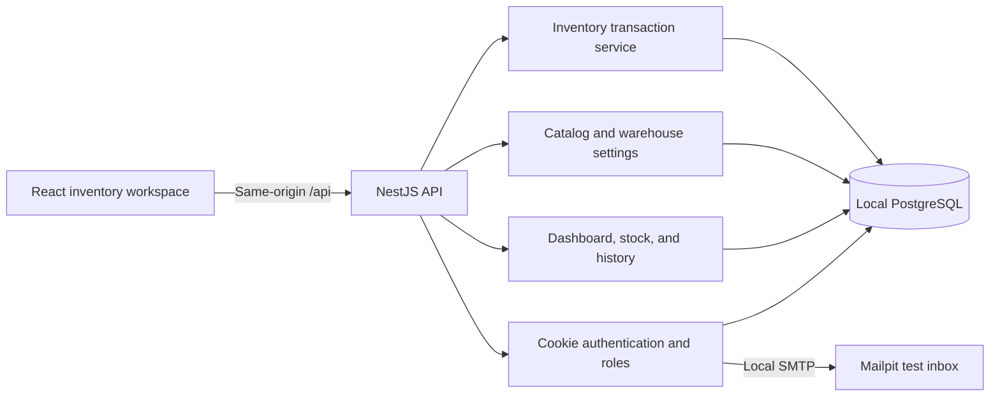

# How StockSense works

The frontend calls the API through Vite’s local proxy. Database access and inventory decisions happen on the server. There are no browser-side stock balances or mock API responses.

## Data model

| Record                    | Purpose                                                                            |
| ------------------------- | ---------------------------------------------------------------------------------- |
| User / PasswordReset      | Roles, account details, token revocation version, expiring hashed reset challenges |
| Product / Category        | Unique SKU, unit, unit cost, active status, product group                          |
| Warehouse / Location      | A warehouse and its named storage areas                                            |
| Contact                   | A supplier or customer                                                             |
| Operation / OperationLine | A receipt, delivery, transfer, or adjustment document and its product quantities   |
| StockBalance              | Current physical quantity and revision for one product at one location             |
| Reservation               | Quantity committed to a ready outgoing document line                               |
| LedgerEntry               | Signed movement, before/after balance, document line, user, and timestamp          |
| ReorderRule               | Minimum available quantity and target per product/location                         |

Quantities use PostgreSQL decimals with three fractional digits; costs use two. Whole-piece products reject fractional quantities. The interface does not total quantities across unrelated units.

## State transitions

```mermaid
stateDiagram-v2
    [*] --> Draft
    Draft --> Ready: Confirm; stock sufficient or incoming/count
    Draft --> Waiting: Confirm; outgoing stock insufficient
    Waiting --> Ready: Check availability; reserve all lines
    Ready --> Done: Validate atomically
    Draft --> Canceled
    Waiting --> Canceled
    Ready --> Canceled: Release reservations
    Done --> [*]
    Canceled --> [*]
```

Delivery’s Ready state additionally tracks picked and packed timestamps. A validated receipt updates destination stock; a validated delivery reduces source stock; a transfer performs both. An adjustment computes `counted − recorded`, checks the saved balance revision, and posts that delta. Opening stock uses the same posting service.

Operations reserve all lines or none. Serializable transactions prevent competing confirmations from overcommitting the same stock. Movement validation is idempotent for completed documents. Every successful stock posting inserts a ledger entry and updates its balance within the same transaction. Read-only pages refresh after mutations and poll active views for other users’ changes.

## Security and scope

Session JWTs live in HttpOnly, SameSite=Strict cookies, scoped to `/api`. Every mutation requires the app’s custom header and validates any supplied Origin. Nest validates and rejects extra DTO fields. Authentication checks the database token version on every request. Manager-only routes enforce authorization on the server; hiding a button is only a usability choice.

Auth endpoints use local process rate limits. Password reset challenges are hashed, expire in ten minutes, have a five-attempt limit, and are consumed on success. Email capture stays on loopback. This is a single local workspace suitable for a hackathon demonstration; a public production service would require additional deployment, account-administration, monitoring, and recovery work.

The direct database and local test scripts use explicit hostname, port, and database-name guards. Only the disposable test database is reset by tests. The application seed skips an existing database.
